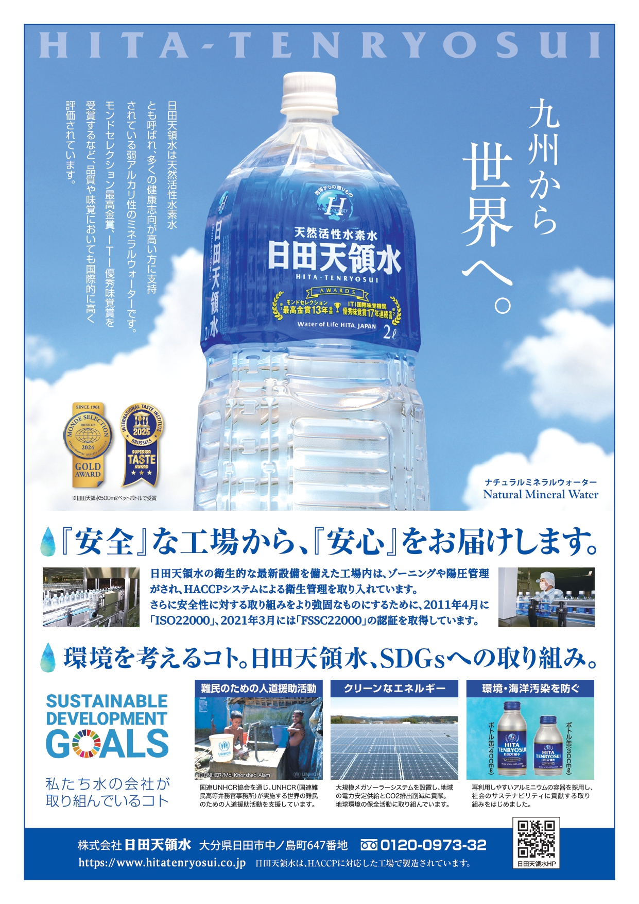

::: {.index-guide}
::: {.index-intro}
::: {}
# 平和への課題：補遺

AJMUN 37th 背景資料のHTML版です。このページでは、本文の読み進め方、検索、プレビュー、注釈、PDF参照の使い方をまとめています。

::: {.index-meta}
[発行日: 2025-11-20]{.index-chip}
[形式: HTML / PDF]{.index-chip}
[用途: 閲覧・検索・確認]{.index-chip}
:::

::: {.index-actions}
[本文を開く](content/00_front.html){.primary}
[第1章へ](content/01_ch01.html){.ghost}
[索引へ](content/96_index.html){.ghost}
[PDF版](#){.ghost data-pdf-link="true"}
:::
:::

::: {.index-cover}

:::
:::

## 基本操作 {#basic-use .index-section}

::: {.feature-list}
::: {.feature-item}
### 章へ移動する

左パネルの「各章」「章内」「全体」タブから移動します。リンクにカーソルを置くと、移動前にプレビュー操作を選べます。
:::

::: {.feature-item}
### 本文内リンクを確認する

本文、脚注、索引、目次のリンクは、直接移動だけでなくプレビュー表示、本文へ移動、トーストへの格納を使えます。
:::

::: {.feature-item}
### Google Docsリンクを開く

Google Docsへのリンクは、プレビュー、別タブで開く、リンクコピーを選べます。本文から不用意に外部ページへ移動しないようにしています。
:::

::: {.feature-item}
### 脚注とコメントを見る

右パネルには脚注、コメント、両方の表示があります。右パネル内のリンクも本文と同じようにプレビュー対象になります。
:::

::: {.feature-item}
### 検索と索引を使う

ヘッダー検索と索引ページから語句を探せます。索引の項目は該当箇所へ移動できます。
:::

::: {.feature-item}
### 表示状態を保存する

文字サイズ、テーマ、コメント、マーカー、プレビュー状態はブラウザ内に保存されます。端末やブラウザを変えると共有されません。
:::
:::

## PDFと印刷 {#printing .index-section}

PDF版が利用できる環境では、上部の「PDF版」ボタンから印刷用PDFを開いてください。
HTML本文は閲覧・検索・注釈向け、PDF版は紙面確認・配布・印刷向けです。

- 用紙: A4を基準にし、ブラウザ印刷ではなくPDFビューアから印刷することを推奨します。
- 倍率: 「実際のサイズ」または「用紙に合わせる」を使い、プレビューでページ欠けがないことを確認してください。
- 注釈: HTML上のハイライトやコメントは利用者の端末内データであり、PDFには反映されません。
- PDF未生成時: ボタンには「PDF準備中」と表示されます。その場合はHTML版を利用してください。

## 注意事項 {#notes .index-section}

- このHTML版は閲覧補助を目的としています。公式に配布・印刷する場合はPDF版を確認してください。
- プレビュー、コメント、マーカーなどの状態はローカル保存です。必要に応じて一覧画面から整理してください。
- 外部リンクは別タブで開きます。Google Docsリンクは、まずプレビュー操作を表示します。
- モバイル環境では、画面幅に合わせて左パネルや右パネルの表示が変わります。

## 印刷用画像 {#print-assets .index-section}

以下は印刷・確認用の代表画像です。本文の閲覧は上部の本文リンクまたは左パネルから開始してください。

::: {.index-print-gallery}
::: {.index-print-asset}

広告ページ
:::

::: {.index-print-asset}

裏表紙
:::
:::
:::
